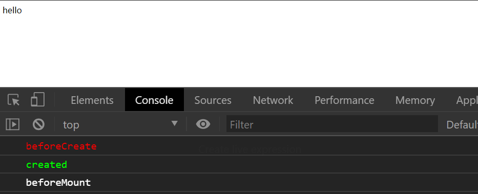
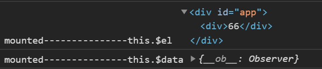

---
{
  "title": "Vue生命周期解析",
}
---

# Vue生命周期解析

> 理解Vue生命周期，能理解很多开发过程中的误区，在恰当的钩子中做恰当的事情。

## 官方图解


## 每个阶段发生了什么

我们通过代码来分析每个阶段发生了哪些事情

```html
  <div id="app">
    <div>{{ msg }}</div>
    <div>{{ a }}</div>
    <button @click="change">改变a</button>
  </div>
```

```javascript
  // 省略Vue的引入
  const vm = new Vue({
    el: '#app',
    data: {
      msg: 123,
    },
    beforeCreate() {
      this.a = 1;
      this.add && this.add();
      console.log('beforeCreate---------------this.$el', this.$el);
      console.log('beforeCreate---------------this.$data', this.$data);
    },
    created() {
      this.a++;
      this.add && this.add();
      console.log('created---------------this.$el', this.$el);
      console.log('created---------------this.$data', this.$data);
    },
    beforeMount() {
      this.a++;
      console.log('beforeMount---------------this.$el', this.$el);
      console.log('beforeMount---------------this.$data', this.$data);
    },
    mounted() {
      this.a = 6;
      this.msg = 66;
      console.log('mounted---------------this.$el', this.$el);
      console.log('mounted---------------this.$data', this.$data);
    },
    methods: {
      change() {
        this.a = 77;
      },
      add() {
        console.log('能调用method');
      }
    },
  });
```


  
话不多说，直接贴结果
我们发现，我们在`beforeCreate` 中创建了`a`属性，赋值为1，最后视图体现，它却变成了`mounted`中修改的6，难道它是响应式的？？  
但是我们点击改变按钮时，`a`却没有变化，分析如下：  

### beforeCreate阶段

我们点击按钮`a`的值没有发生变化，说明属性a不是响应式的，那就说明在`beforeCreate`之前`Vue`就已经将`data`中的属性进行了监听，之后添加的不再是响应式的了  
而且`beforeCreate`的时候，`$data` 和 `$el` 都无法获取，`method` 也无法调用

### created阶段

这个阶段我们可以进行方法的调用，而且`$data`中也已经有我们定义的内容了，故这一阶段可以进行一些数据操作，但仍然获取不到DOM元素。

### beforeMount之前

根据官网的生命周期图我们发现，在`create`之后，会进行两个判断

- 是否有`el`选项
  - 如果没有，将会停止，除非手动调用`vm.$mount(el)`方法
  - 如果有，就继续
- 是否有`template`选项
  - 如果有，就将`template模板`编译为`render函数`
  - 如果没有，就将`el`的`outHTML`作为`template模板`

我们可以通过代码来测试一下

#### 没有`el`时

```html
  <div id="app">
    <p>{{ msg }}</p>
  </div>
```

```javascript
  // 省略Vue的引入
  const vm = new Vue({
    data: {
      msg: 'hello vue',
    },
    beforeCreate() {
      console.log('%c beforeCreate', 'color: #ff0000');
    },
    created() {
      console.log('%c created', 'color: #00ff00');
    },
    beforeMount() {
      console.log('%c beforeMount', 'color: #0000ff');
    },
  });
```

  
**初始化的时候如果没有提供`el选项`，那么`vue的初始化`到`created`就停止了**

- 手动调用`$mount()`方法
- `$mount`接收一个`DOM元素或者选择器`

```html
  <div id="app">
    <p>{{ msg }}</p>
  </div>
```

```javascript
  // 省略Vue的引入
  const vm = new Vue({
    data: {
      msg: 'hello',
    },
    beforeCreate() {
      console.log('%c beforeCreate', 'color: #ff0000');
    },
    created() {
      console.log('%c created', 'color: #00ff00');
    },
    beforeMount() {
      console.log('%c beforeMount', 'color: white');
    },
  }).$mount('#app')
  // vm.$mount(document.getElementById('app'));
  // vm.$mount('#app');
```

  

#### 没有`template`时

我们演示的例子都是这种情况，更进一步，我们验证一下：

```javascript
  // 省略Vue的引入
  const vm = new Vue({
    el: '#app',
    data: {
      msg: 'hello',
    },
    template: `${document.getElementById('app').outerHTML}`,
    beforeCreate() {
      console.log('%c beforeCreate', 'color: #ff0000');
    },
    created() {
      console.log('%c created', 'color: #00ff00');
    },
    beforeMount() {
      console.log('%c beforeMount', 'color: white');
    },
  });
```

我们手动提供一个`template`，为`el`的`outHTML`，发现与不提供`template`时渲染的结果的一致。

```javascript
  // 省略Vue的引入
  const vm = new Vue({
    el: '#app',
    data: {
      msg: 'hello',
    },
    template: `<span>test template</span>`,
    beforeCreate() {
      console.log('%c beforeCreate', 'color: #ff0000');
    },
    created() {
      console.log('%c created', 'color: #00ff00');
    },
    beforeMount() {
      console.log('%c beforeMount', 'color: white');
    },
  });
```

  
已指定`template`的情况下，`Vue`会使用已有的`template`进行渲染, `template`的优先级大于`el`的`outHTML`

#### `render函数`

`Vue`会将`template`编译成`render函数`，那如果我们提供了`render函数`呢

```javascript
  // 省略Vue的引入
  const vm = new Vue({
    el: '#app',
    data: {
      msg: 'hello',
    },
    template: `<span>test template</span>`,
    render(createElement) {
      return createElement(
        'span',
        'render func',
      );
    },
    beforeCreate() {
      console.log('%c beforeCreate', 'color: #ff0000');
    },
    created() {
      console.log('%c created', 'color: #00ff00');
    },
    beforeMount() {
      console.log('%c beforeMount', 'color: white');
    },
  });
```

  
`Vue` 会直接使用已有的`render函数`进行渲染  
**优先级: render函数 > template > el**

### beforeMount

  
`beforeMount`时已经打印出了`$el`属性，但是数据并没有挂载上去  

### mounted

  
`mounted`时，我们已经看到了最终的DOM结构，说明此时已经渲染完成，而且渲染的值是我们在之前阶段修改后的最终的值。
> 创建`vue`实例的`$el`属性，并替换`el`

### beforeUpdate && updated

数据更新前与更新后触发的钩子

```html
  <div id="app">
    <div>{{ msg }}</div>
    <button @click="change">改变msg</button>
  </div>
```

```javascript
  // 省略Vue的引入
  const vm = new Vue({
    el: '#app',
    data: {
      msg: 'hello vue',
      test: 'abc',
    },
    beforeUpdate() {
      console.log('%c beforeUpdate: %s', 'color: #ff0000', this.msg);
    },
    updated() {
      console.log('%c updated: %s', 'color: #00ff00', this.msg);
    },
    methods: {
      change() {
        this.msg = 'hello world';
        // this.$nextTick(() => {
        //   this.msg = 'hello world1';
        // });
      },
    }
  });
  vm.test = '123';
```

  

可以看到，在两个钩子中，`data`都已经是更新后的值了，区别在于，`beforeUpdate`时，`DOM`还没有更新，此时可以操作`旧的DOM`  
**`更新钩子`只在引起视图变化的属性变化时触发**

### beforeDestroy && destroyed

> `beforeDestroy`触发时，`this`还能获取到，这时可以进行销毁定时器，解绑组件中的全局事件，销毁全局对象等操作  
> `destroyed`触发时，Vue 实例指示的所有东西都会解绑定，所有的事件监听器会被移除，所有的子实例也会被销毁

## 参考资料

[vue 生命周期深入](https://juejin.im/entry/6844903602356502542 "掘金")  
[vue生命周期详解](https://juejin.im/post/6844903607284793352#heading-0 "掘金")
