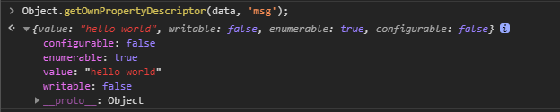
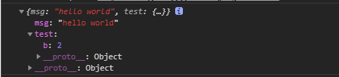

---
{
  "title": "Vue中的非响应式数据",
}
---

# Vue中的非响应式数据

## 响应式数据

Vue实例创建时，Vue会遍历data中的属性，加入到响应式系统中，当属性发生变化时，当属性发生变化时，Vue会同时更新视图。

实际开发中也有数据非响应式的情况

## 场景一: 在Vue实例创建后添加的属性

举个例子：

```html
  <div id="app">
    <p>{{ msg }}</p>
    <!-- 这里的 `msg` 不会更新！ -->
    <button v-on:click="msg = '123'">Change it</button>
  </div>
```

```javascript
  // 省略Vue的引入
  const vm = new Vue({
    el: '#app',
    data: {
      msg: 'hello Vue',
    },
  });
```

- 特殊情况  
在 `created()` 中添加属性，此时响应式已经添加完成

```html
  <div id="app">
    <p>{{ msg }}</p>
    <!-- 这里的 `msg` 不会更新！ -->
    <button v-on:click="msg = '123'">Change it</button>
  </div>
```

```javascript
  // 省略Vue的引入
  const vm = new Vue({
    el: '#app',
    data: {},
    created() {
      this.msg = 'hello world';
    },
  });
```

## 场景二: 主动冻结 `Object.freeze()`  

```html
  <div id="app">
    <p>{{ msg }}</p>
    <!-- 这里的 `msg` 不会更新！ -->
    <button v-on:click="msg = '123'">Change it</button>
  </div>
```

```javascript
  // 省略Vue的引入
  const data = {
    msg: 'hello world',
  };
  Object.freeze(data);
  const vm = new Vue({
    el: '#app',
    data: data,
  });
```

当我们点击改变按钮时，控制台会报错如下:

无法改变一个只读属性, 我们打印下这个data的msg属性描述:
  
**这个属性已经是不可配置且不可写的**

- 冻结局部属性  

```html
  <div id="app">
    <p>{{ obj.test.b }}</p>
    <p>{{ obj.msg }}</p>
    <!-- 这里的 `msg` 不会更新！ -->
    <button v-on:click="change">Change it</button>
  </div>
```

```javascript
  // 省略Vue的引入
  const obj = {
    msg: 'hello world',
    test: {
      b: 1,
    }
  };
  Object.freeze(obj);
  const vm = new Vue({
    el: '#app',
    data: {
      obj,
    },
    methods: {
      change() {
        this.obj.test.b = 2;
        this.obj.msg = '123';
        console.log(this.obj);
      }
    },
  });
```

上述代码中我们将 `data` 中的obj对象冻结了，然后修改其中的属性，发现**视图其实是都没有改变的**  
  
但是观察一下 `console` 的输出，却是不一样的结果，对象属性中的值改变了，而值类型的属性没有改变
这说明 `Object.freeze()` 是**浅冻结**，也就是对嵌套的引用类型不起作用，类似浅拷贝  

那如果我们想彻底地冻结一个对象呢，可以递归地进行冻结  

```javascript
  const deepFreeze = (obj) => {
    // 获取自身的属性，不包括原型链
    const keys = Object.getOwnPropertyNames(obj);
    keys.forEach(key => {
      const val = obj[key];
      if(typeof val === 'object' && val !== null) {
        deepFreeze(val);
      }
      return Object.freeze(obj);
    })
  };
```

- 解冻方法  
  - `Object.assign()` 拷贝到一个新对象
  - 在 `Vue` 中直接 `this.obj = xxx` 覆盖该属性

- **`Object.freeze()` 使用场景**   
`Vue`中渲染大量数据时，而且数据无需改变时，可以通过`Object.freeze()`避开`Vue`的响应式绑定，优化渲染性能  

> `Object.isFrozen(obj)` 可以用来检测一个对象是否被冻结  

## 参考资料

[Vue性能提升之Object.freeze()](https://juejin.im/post/6844903922469961741#heading-10 "掘金")
