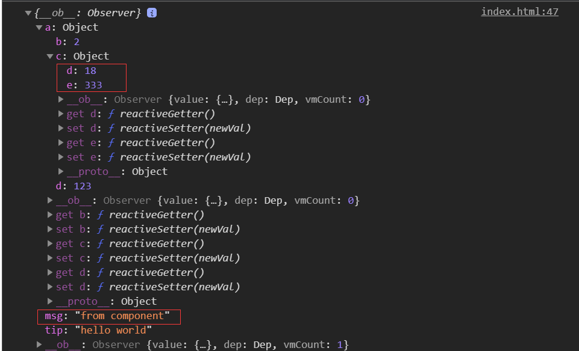
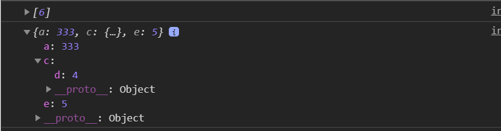
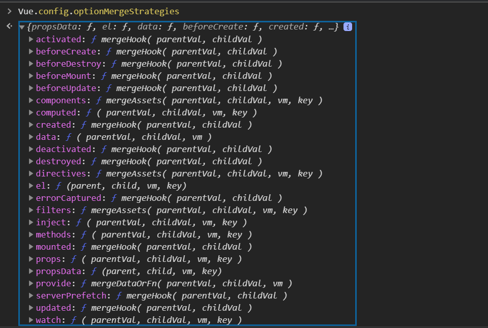
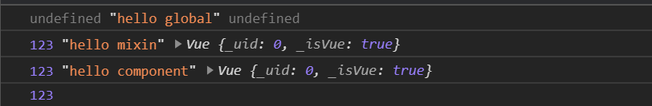
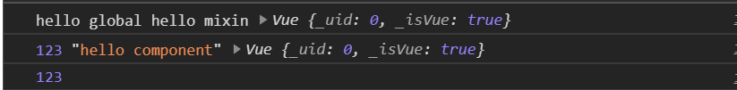

---
{
  "title": "混入",
}
---

# 混入(mixin)

Vue组件可以接受多个混入对象，混入对象可以包含任意组件选项(data，components等)，所有混入对象的选项将被"混合"进入该组件本身的选项。

举个:chestnut:  

```javascript
// 定义一个混入对象
const myMixin = {
  mixinOption: 'mixin options',
  created() {
    console.log('hello from mixin');
  },
  methods: {
    test() {
      console.log('method from mixin');
    }
  },
}
// 省略Vue的引入
const vm = new Vue({
  el: '#app',
  // 在组件中使用
  mixins: [myMixin],
  created() {
    this.test()
    console.log(this.$options.mixinOption);
  },
});
```


## 选项合并

当组件与混入对象中存在同名选项时，会以一种方式进行属性合并。

- 数据对象在内部进行递归合并，发生冲突时组件数据优先级更高。

```javascript
const myMixin = {
  data() {
    return {
      a: {
        b: 1,
        c: {
          d: 1
        }
      },
      msg: 'from mixin',
      tip: 'hello world',
    }
  },
}
// 省略Vue的引入
const vm = new Vue({
  el: '#app',
  mixins: [myMixin],
  data() {
    return {
      a: {
        b: 2,
        d: 123,
        c: {
          e: 333,
          d: 18
        }
      },
      msg: 'from component',
    }
  },
  created() {
    console.log(this.$data);
  },
});
```



::: warning
相同属性是对象时会递归对象进行合并
:::

- 同名钩子函数将合并为一个数组，都将被调用。混入对象的钩子将在自身组件钩子**之前**调用,如开头示例。

- 值为对象的选项，如`method`、`components`等，将被合并为一个对象，两个对象键名冲突时，取组件的键值对。

举个:chestnut:  

```javascript
var mixin = {
  methods: {
    foo: function () {
      console.log('foo')
    },
    conflicting: function () {
      console.log('from mixin')
    }
  }
}

var vm = new Vue({
  mixins: [mixin],
  methods: {
    bar: function () {
      console.log('bar')
    },
    conflicting: function () {
      console.log('from self')
    }
  }
})

vm.foo() // => "foo"
vm.bar() // => "bar"
vm.conflicting() // => "from self"
```

## 全局混入

Vue提供了全局混入的API，一旦全局混入后，将影响每一个之后创建的Vue实例。

```javascript
// 为自定义的选项 'myOption' 注入一个处理器。
Vue.mixin({
  created: function () {
    var myOption = this.$options.myOption
    if (myOption) {
      console.log(myOption)
    }
  }
})
```

::: danger
请谨慎使用全局混入，因为它会影响每个单独创建的 Vue 实例 (包括第三方组件)。大多数情况下，只应当应用于自定义选项，就像上面示例一样。推荐将其作为插件发布，以避免重复应用混入。
:::

## 自定义选项合并策略

自定义选项的默认策略是简单的覆盖已有值。
举个:chestnut:  

```javascript
const myMixin = {
  mixinOption: {
    a: 123,
    c: {
      d: 2
    }
  },
  test: [1, 2, 3]
}
// 省略Vue的引入
const vm = new Vue({
  el: '#app',
  mixins: [myMixin],
  mixinOption: {
    a: 333,
    c: {
      d: 4
    },
    e: 5
  },
  test: [6]
});

console.log(vm.$options.test);
console.log(vm.$options.mixinOption);
```



Vue提供了`Vue.config.optionMergeStrategies`属性来让我们给自定义选项添加自定义的合并逻辑。

我们打印出这个属性：

发现上面挂载了很多选项的合并方法。

```javascript
Vue.config.optionMergeStrategies.myOption = function (toVal, fromVal, vm) {
  // 返回合并后的值
  console.log(toVal, fromVal, vm);
  return 123;
};

Vue.mixin({
  myOption: 'hello global',
});

const myMixin = {
  myOption: 'hello mixin'
}
// 省略Vue的引入
const vm = new Vue({
  el: '#app',
  mixins: [myMixin],
  myOption: 'hello component'
});

console.log(vm.$options.myOption);
```



会逐层向下合并，在全局合并第一次后，便使用我们自定义的返回值进行之后的合并。

如果我们简单调换下定义的位置呢

```javascript
Vue.mixin({
  myOption: 'hello global',
});

Vue.config.optionMergeStrategies.myOption = function (toVal, fromVal, vm) {
  // 返回合并后的值
  console.log(toVal, fromVal, vm);
  return 123;
};

const myMixin = {
  myOption: 'hello mixin'
}
// 省略Vue的引入
const vm = new Vue({
  el: '#app',
  mixins: [myMixin],
  myOption: 'hello component'
});

console.log(vm.$options.myOption);
```



我们发现，全局混入使用的还是默认的合并策略，因为此时我们还没有覆盖掉默认的合并策略。

## 总结

- 使用混入可以定义多个混入对象，每个对象包含组件的任意选项。
- 混入对象中的选项会与组件的选项进行合并，不同的选项类型(如 data，methods等)会有不同的合并策略。
- 全局混入时对每一个之后创建的组件(包括第三方组件)都生效，要谨慎使用。
- 当对自定义选项进行合并时，默认是相同的直接进行替换，我们也可以自定义它的处理逻辑。
