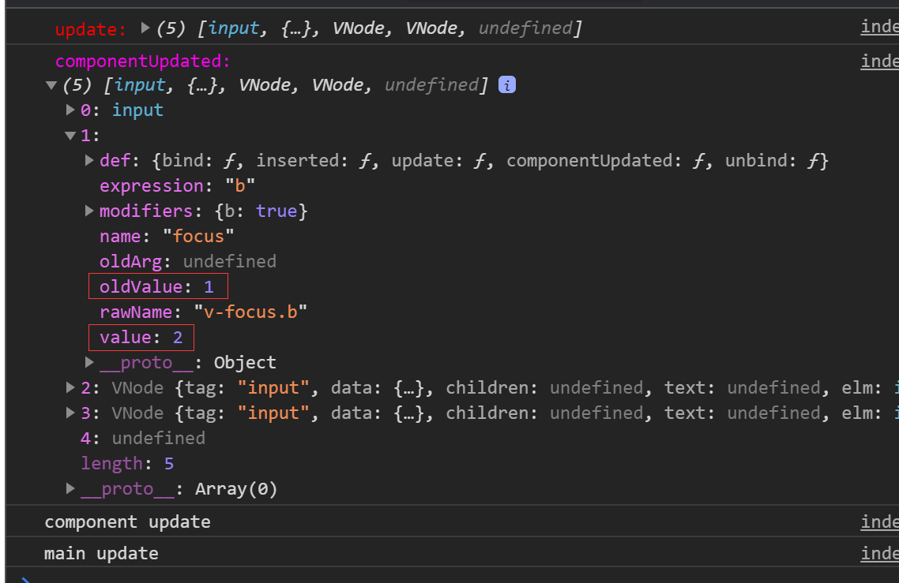

---
{
  "title": "自定义指令",
}
---

# 自定义指令

## 介绍

什么是Vue指令呢，指令是带有`v-`前缀的特殊attribute。Vue有几种内置指令，如`v-if, v-show, v-for`等。也提供了使开发者自定义指令的能力。

指令的注册方式和组件一样，可以支持全局注册，也可以支持局部注册，如下：

```javascript
// 全局注册
Vue.directive('focus', {
  // 当被绑定的元素插入到 DOM 中时……
  inserted: function (el) {
    // 聚焦元素
    el.focus()
  }
});
```

```javascript
// 局部注册
directives: {
  focus: {
    // 指令的定义
    inserted: function (el) {
      el.focus()
    }
  }
}
```

上面我们定义了一个自动聚焦的指令。
使用如下:

```html
<input v-focus />
```

## 钩子函数

和组件一样，指令也有钩子函数。

> - `bind`: 只调用一次，指令第一次绑定到元素时调用
> - `inserted`: 被绑定元素插入**父节点**时调用(仅保证父节点存在，但不一定已被插入文档中。)
> - `update`: 所在组件的`VNode`更新时调用，**但是可能发生在其子VNode更新之前**。指令的值可能发生了改变，也可能没有。
> - `componentUpdated`: 指令所在组件的VNode及其子VNode全部更新后调用。
> - `unbind`: 只调用一次，指令与元素解绑时调用。

## 钩子函数参数

- `el`: 指令所绑定的元素，可以用来直接操作DOM。
- `binding`: 一个对象，包含以下property：
  - `name`: 指令名，不包括`v-`前缀，如`v-focus`中的`focus`。
  - `value`: 指定的绑定值，如`v-directive="1 + 1"`中，绑定值`value为2`。
  - `oldValue`: 指令绑定的前一个值，仅在`update`和`componentUpdated`钩子中可用。无论值是否改变都可用。
  - `expression`: 字符串形式的指令表达式。例如 `v-directive="1 + 1"`中，表达式为`"1 + 1"`。
  - `arg`：传给指令的参数，可选。例如：`v-directive:foo`中，参数为`foo`。
  - `modifiers`：一个包含修饰符的对象。例如: `v-directive.foo.var`中，修饰符为对象为`{ foo: true, bar: true }`。

举个:chestnut:  

```html
<div id="app">
  <hello-world v-if="show">
    <input type="text" v-focus.b="b" data-x="test" placeholder="插槽">
    插槽： {{ b }}
  </hello-world>
  <button @click="show = !show">展示与否</button>
  <button @click="b++">b++</button>
</div>
```

```javascript
Vue.directive('focus', {
  // 当被绑定的元素插入到 DOM 中时……
  bind(...args) {
    console.log('%c bind: %o', 'color: red', args);
  },
  inserted: function (el) {
    // 聚焦元素
    el.focus()
  },
  update(...args) {
    console.log('%c update: %o', 'color: red', args);
  },
  componentUpdated(...args) {
    console.log('%c componentUpdated: %o', 'color: #ff00f0', args);
  },
  unbind(...args) {
    console.log('%c unbind: %o', 'color: #ffff00', args);
  }
});
Vue.component('hello-world', {
  template: `
    <div>
      <slot></slot>
      <input type="text" placeholder="组件内" />
      组件内：{{a}}
      <button @click="a++">a++</button>
    </div>
  `,
  updated() {
    console.log('component update');
  },
  data() {
    return {
      a: 1,
    }
  },
})
// 省略Vue的引入
const vm = new Vue({
  el: '#app',
  data() {
    return {
      show: true,
      b: 1
    }
  },
  updated() {
    console.log('main update');
  },
});
```

上面我们定义了一个`hello-world`组件，组件内部有一个输入框，另外使用插槽插入了一个输入框， 一个聚焦的自定义全局指令，并在插槽输入框上绑定了这个指令。
`a++`与`b++`分别可以控制组件内的更新与组件外的更新。

- 初始阶段


- 点击`a++`后

此时只有组件的`updated`方法被调用。

- 点击`b++`后


此时因为我们触发了指令所在组件的更新，其实指的是外部父组件，而因为插槽内的值更新了，也触发了子组件的更新。

我们修改一下代码，将指令绑定在子组件内的input上，即：

```javascript
Vue.component('hello-world', {
  template: `
    <div>
      <slot></slot>
      <input type="text" v-focus.a="a" placeholder="组件内" />
      组件内：{{a}}
      <button @click="a++">a++</button>
    </div>
  `,
  updated() {
    console.log('component update');
  },
  data() {
    return {
      a: 1,
    }
  },
})
```

- 初始状态
  

- 点击`a++`后

此时是只涉及到组件内的更新

- 点击`b++`后

此时，我们发现既触发了子组件的更新，也触发了父组件的更新，原因在于我们修改了插槽中的内容，但是指令的绑定值是并没有改变的，但也会触发更新的钩子。  
需要注意更新钩子是否触发是取决于**所在组件的`VNode`更新时调用**

## 动态指令参数

可以通过`v-mydirective:[argument]="value"`来动态定义我们传给指令的参数。这加大了指令运用的灵活度，我们可以根据参数的不一样去动态控制指令的行为。

## 函数简写

在很多时候，你可能想在 bind 和 update 时触发相同行为，而不关心其它的钩子。比如这样写：

```javascript
Vue.directive('color-swatch', function (el, binding) {
  el.style.backgroundColor = binding.value
});
```

## 对象字面量

指令需要多个值的时候，我们可以传入对象或者数组，zhilhanshu能够接受所有合法的JavaScript表达式

```html
<div v-demo="{ color: 'white', text: 'hello!' }"></div>
<div v-demo="[1, 2, 3]"></div>
```

```javascript
Vue.directive('demo', function (el, binding) {
  console.log(binding.value.color) // => "white"
  console.log(binding.value.text)  // => "hello!"
});
```

## 参考链接

[撸一个 Vue 自定义指令实现一键 Copy的功能](https://juejin.im/post/6844903942321602568 "掘金")
